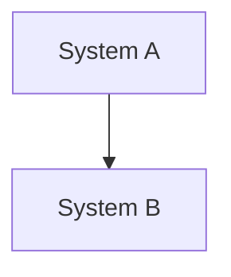

# Enterprise Architecture Diagrams

Generate professional EA diagrams using Mermaid syntax in fenced code blocks. The Control UI renders `mermaid` code blocks as interactive SVG diagrams with export capability.

## Output Format

Always wrap diagram code in a fenced code block with the `mermaid` language identifier:

````

````

## Diagram Selection Guide

| EA Need                  | Mermaid Diagram Type | When to Use                                 |
| ------------------------ | -------------------- | ------------------------------------------- |
| System landscape         | `C4Context`          | Show systems and actors at highest level    |
| Application architecture | `C4Container`        | Show containers within a system boundary    |
| Component design         | `C4Component`        | Show internal components of a container     |
| Deployment topology      | `C4Deployment`       | Show infrastructure and deployment nodes    |
| Business process         | `flowchart`          | Show process flows, decision trees          |
| Service interactions     | `sequenceDiagram`    | Show runtime message flows between services |
| Domain model             | `classDiagram`       | Show entities, relationships, attributes    |
| State machine            | `stateDiagram-v2`    | Show lifecycle states and transitions       |
| Data pipeline            | `flowchart LR`       | Show data flow through processing stages    |
| Timeline/roadmap         | `gantt`              | Show phases, milestones, dependencies       |
| Entity relationships     | `erDiagram`          | Show database schema and relationships      |

## C4 Model Diagrams

C4 is the primary framework for EA diagrams. Use the four levels:

- **C4 Level 1 - Context**: Read `references/c4-model.md` for system context patterns
- **C4 Level 2 - Container**: Read `references/c4-model.md` for container patterns
- **C4 Level 3 - Component**: Read `references/c4-model.md` for component patterns
- **C4 Level 4 - Deployment**: Read `references/c4-model.md` for deployment patterns

## Common EA Patterns

For TOGAF views, ArchiMate layers, integration patterns, and other enterprise patterns, read `references/enterprise-patterns.md`.

## Best Practices

- Start with C4 Context (Level 1) before diving into lower levels
- Label all relationships with verbs describing the interaction
- Include technology annotations on containers and components
- Use consistent naming: PascalCase for systems/containers, camelCase for relationships
- Keep diagrams focused: one concern per diagram, max ~15 nodes
- Add a title to every diagram for context
- For complex architectures, produce multiple focused diagrams rather than one overloaded diagram
