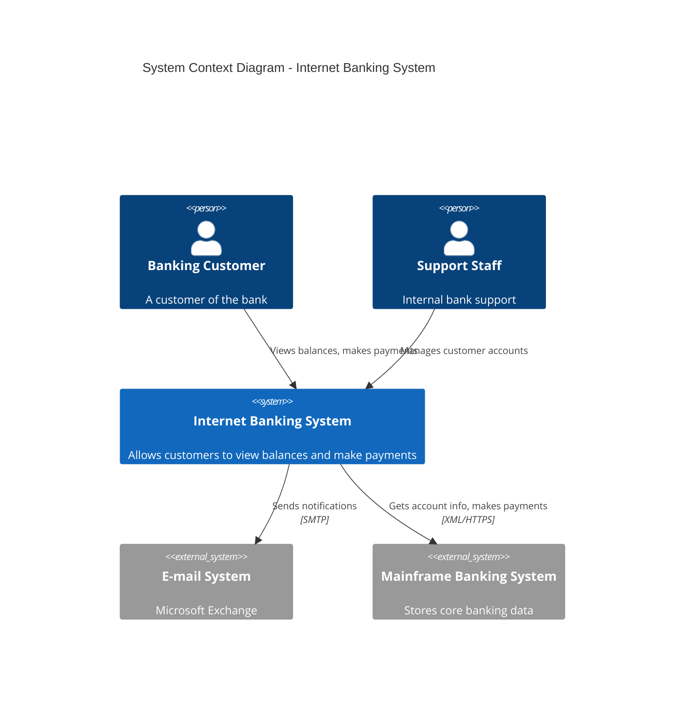
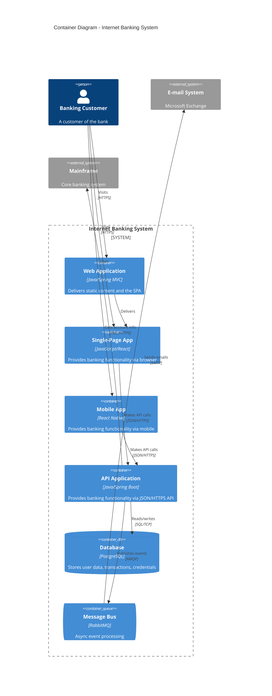
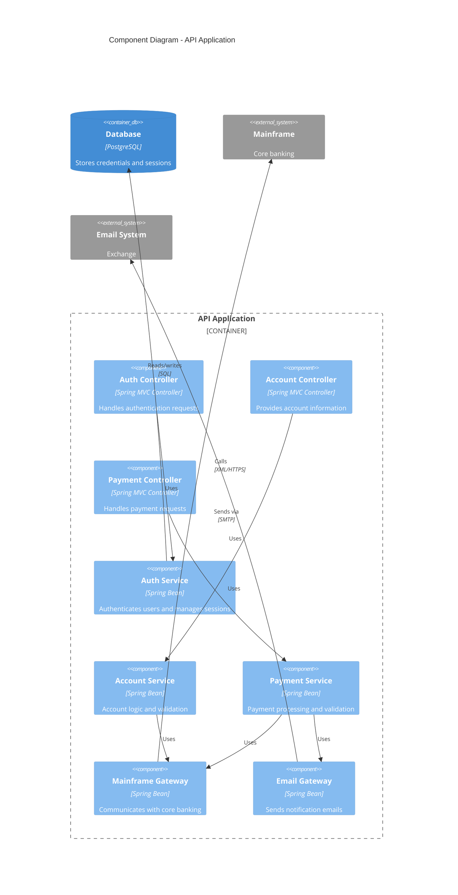
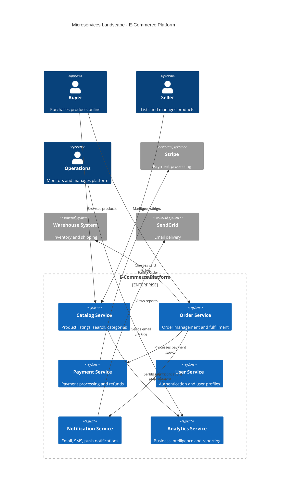

# C4 Model Mermaid Patterns

## C4 Level 1 - System Context Diagram

Shows the system under design, its users, and external system dependencies.



## C4 Level 2 - Container Diagram

Zooms into a system to show its containers (applications, data stores, etc.).



## C4 Level 3 - Component Diagram

Shows the internal components of a container.



## C4 Level 4 - Deployment Diagram

Shows how containers are mapped to infrastructure.

```mermaid
C4Deployment
  title Deployment Diagram - Internet Banking (Production)

  Deployment_Node(cdn, "CDN", "CloudFront") {
    Container(staticAssets, "Static Assets", "S3", "HTML, CSS, JS bundles")
  }

  Deployment_Node(aws, "AWS", "us-east-1") {
    Deployment_Node(eks, "EKS Cluster", "Kubernetes") {
      Deployment_Node(webPod, "Web Pods", "x3 replicas") {
        Container(webApp, "Web Application", "Java/Spring", "Serves SPA and handles requests")
      }
      Deployment_Node(apiPod, "API Pods", "x5 replicas") {
        Container(apiApp, "API Application", "Java/Spring Boot", "Business logic and API")
      }
    }
    Deployment_Node(rds, "RDS", "Multi-AZ") {
      ContainerDb(db, "Database", "PostgreSQL 15", "Primary + read replicas")
    }
    Deployment_Node(mqNode, "Amazon MQ", "Active/Standby") {
      ContainerQueue(mq, "Message Bus", "RabbitMQ", "Event processing")
    }
  }

  Rel(cdn, webApp, "Routes to", "HTTPS")
  Rel(webApp, apiApp, "Calls", "HTTPS")
  Rel(apiApp, db, "Reads/writes", "SQL/TLS")
  Rel(apiApp, mq, "Publishes", "AMQP/TLS")
```

## Microservices Landscape (C4 Context variant)



## Tips

- Use `Person()` for human actors, `System()` for internal systems, `System_Ext()` for external
- Use `Container()` for applications, `ContainerDb()` for databases, `ContainerQueue()` for queues
- Use `Component()` for code-level components inside a container
- Use `System_Boundary()`, `Container_Boundary()`, `Enterprise_Boundary()` to group related elements
- Use `Deployment_Node()` to represent infrastructure (servers, clusters, cloud regions)
- Always include a `title` for context
- Describe relationships with verb phrases: "Reads from", "Sends to", "Authenticates via"
- Include technology in the relationship label when relevant: `"JSON/HTTPS"`, `"SQL/TCP"`
