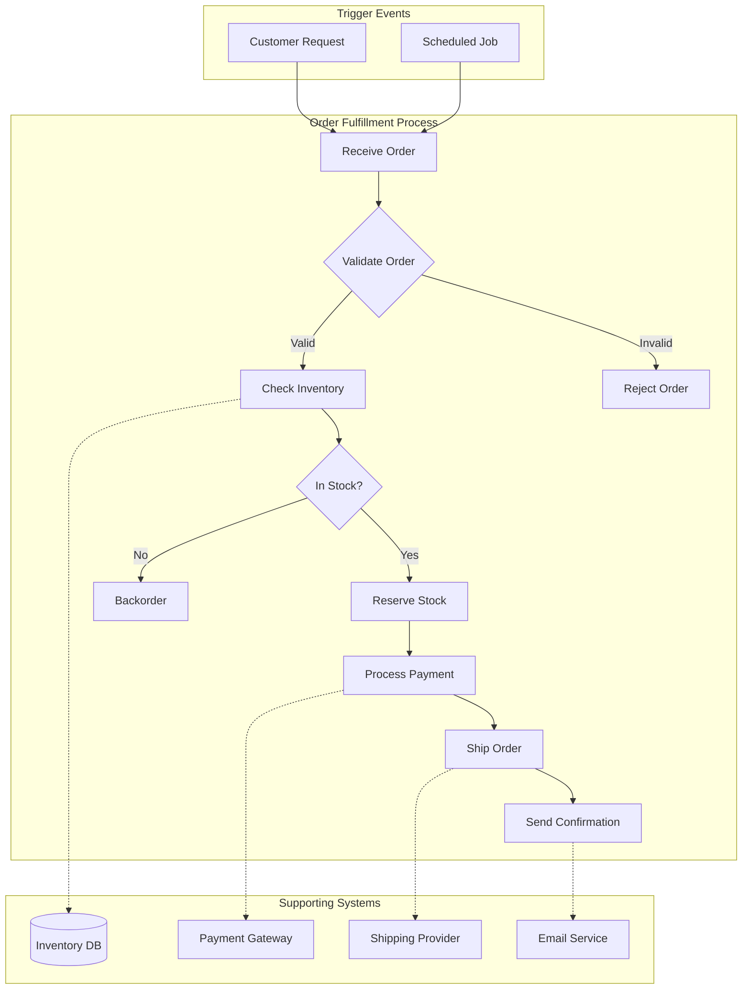
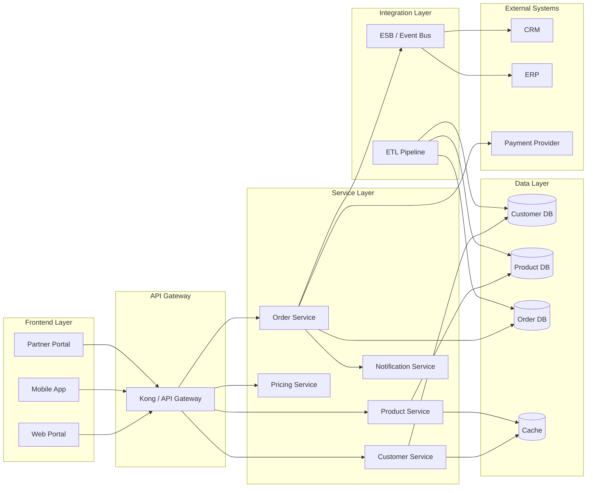
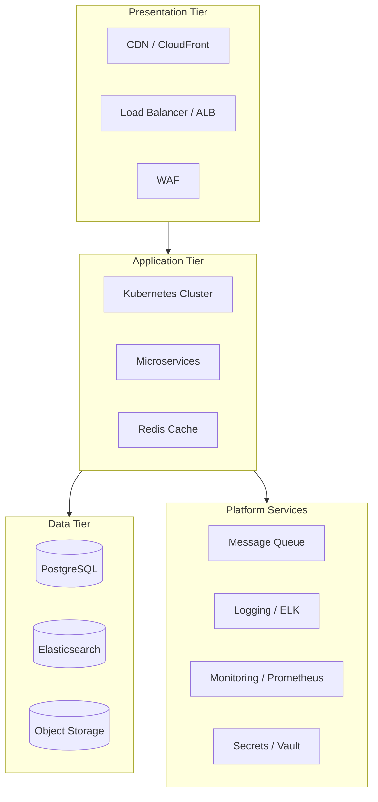
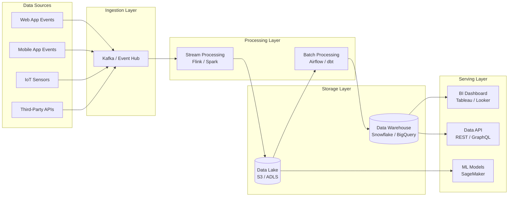
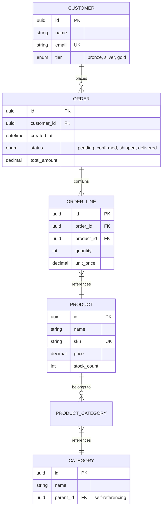
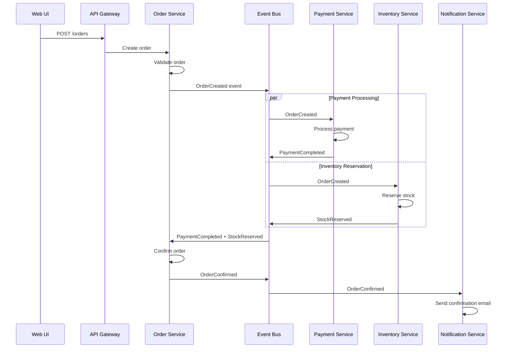
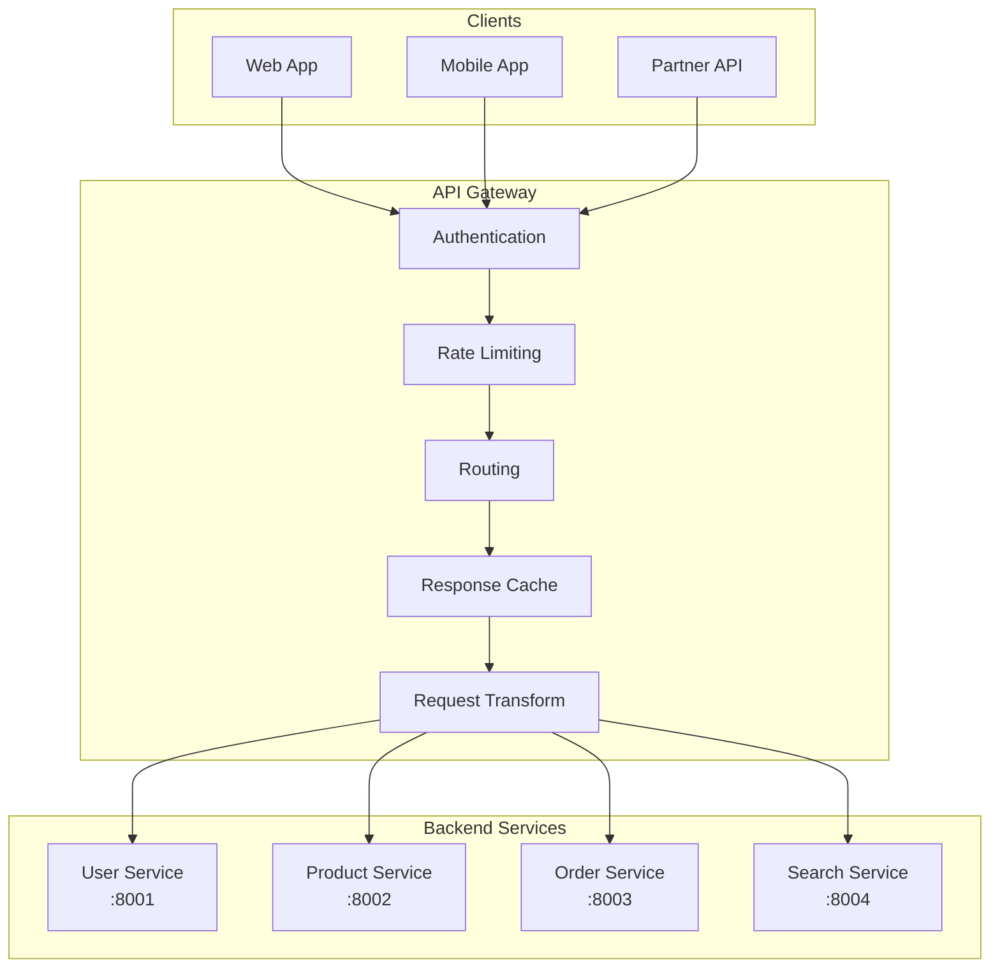
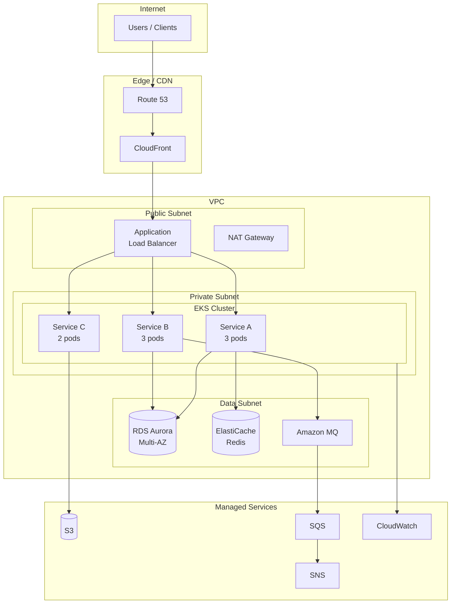
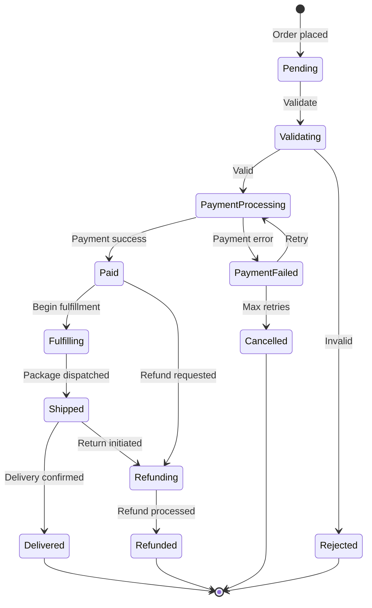
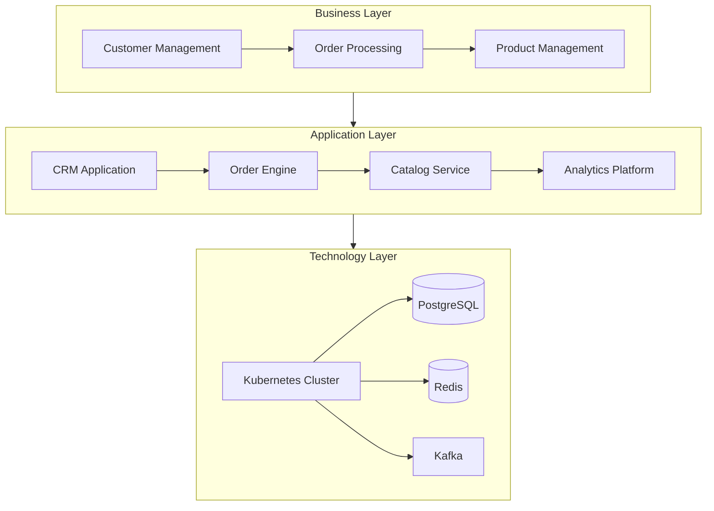

# Enterprise Architecture Patterns

## TOGAF Architecture Views

### Business Architecture - Process Flow

### Application Architecture - Integration Map

### Technology Architecture - Stack Diagram

## Data Architecture

### Data Flow Diagram

### Entity Relationship - Domain Model

## Integration Architecture

### Event-Driven Architecture

### API Gateway Pattern

## Solution Architecture

### Cloud-Native Architecture

### Microservices State Machine

## ArchiMate Layers (via Flowchart)

Mermaid does not have native ArchiMate support, but the three-layer model can be
represented with subgraph nesting.

## Tips for Enterprise Diagrams

- Use subgraphs to represent architectural boundaries and layers
- Use `direction LR` or `direction TB` within subgraphs for layout control
- Use dashed arrows (`-.->`) for async/event-driven relationships
- Use thick arrows (`==>`) for primary/critical paths
- Use notes and labels to indicate protocols and technologies
- Keep color coding consistent: same color = same architectural concern
