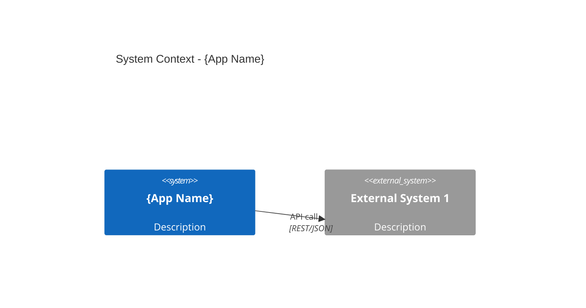

# Application Passport Management

Create, update, and query application passports in the enterprise architecture landscape.

## Operations

### Create a New Passport

1. Allocate a new ID using `nextId(landscapePath, domain, "APP")`
2. Gather required fields (interactively or from provided data):
   - name, domain, status, togaf_layer
   - owners (business, technical)
   - technology stack, hosting model, data classification
   - known integrations
   - compliance requirements
   - SLA targets
3. Create the application directory: `landscape/model/applications/{ID}/`
4. Write `passport.yaml` validated against `ApplicationPassportSchema`
5. Write `passport.md` with a narrative description
6. Generate initial `context.mmd` (C4 context diagram) showing known integrations
7. Create empty `data-matrix.yaml` for future data entity mappings
8. Update `landscape/model/applications/_index.yaml` with the new entry
9. Update the domain definition in `landscape/model/domains/{DOMAIN}/domain.yaml`

### Update an Existing Passport

1. Read the current passport from `landscape/model/applications/{ID}/passport.yaml`
2. Apply the requested changes
3. Update the `updated` timestamp
4. Re-validate against `ApplicationPassportSchema`
5. If integrations changed, regenerate `context.mmd`
6. If domain changed, update both old and new domain definitions

### Query Passports

- List all applications: read `landscape/model/applications/_index.yaml`
- Filter by domain: match the `domain` field
- Filter by status: match `status` (plan/build/run/retire)
- Search by technology: scan `technology.stack` arrays

## Context Diagram Generation

When creating or updating integrations, generate a C4 context diagram:



Use the `c4ContextTemplate()` helper from `src/archiclaw/render/mermaid.ts`.

## File Locations

- Passports: `landscape/model/applications/{ID}/passport.yaml`
- Narratives: `landscape/model/applications/{ID}/passport.md`
- Context diagrams: `landscape/model/applications/{ID}/context.mmd`
- Data matrices: `landscape/model/applications/{ID}/data-matrix.yaml`
- Application registry: `landscape/model/applications/_index.yaml`

## Rendering Diagrams

Generate C4 context diagrams using the render CLI:

```bash
bun src/archiclaw/render/cli.ts c4 --app "{APP_NAME}" --integrations landscape/model/applications/{ID}/passport.yaml --out landscape/model/applications/{ID}/context.svg
```

Or render any `.mmd` file:

```bash
bun src/archiclaw/render/cli.ts render landscape/model/applications/{ID}/context.mmd
```

## Guardrails

- Always validate against `ApplicationPassportSchema` before writing
- Never overwrite a passport without reading it first
- Ensure the application ID matches the folder name
- Update the registry `_index.yaml` whenever creating or deleting an application
- Use `nextId()` for new IDs; never manually construct them
- When updating integrations, check that target application IDs exist in the landscape
